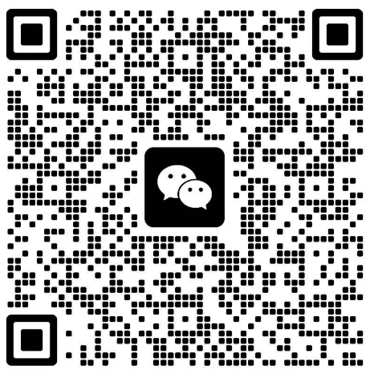
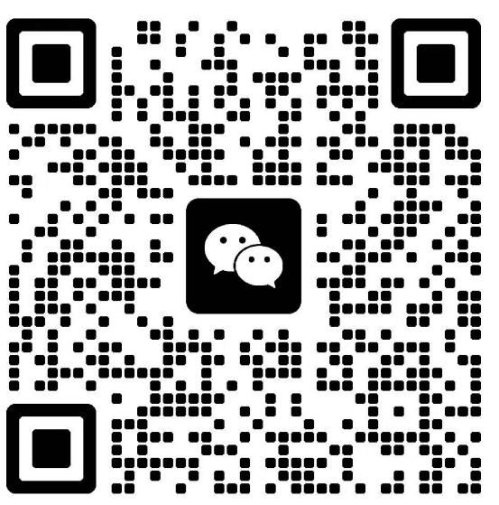

<h1 align="center">快选写作API</h1>
API使用chatgpt、deepseek、llama3等市面上常用对话大模型，免去prompts提示词，根据特定场景快速对接自己的业务

浅度短文永久免费

## 项目地址集

在 [GitHub](https://github.com/XM-Right/kx-chatgpt-prompts-api)、[Gitee](https://gitee.com/bimingxing/kx-chatgpt-prompts-api)、[网站](https://chat.suzi-ai.com/classify?s=8) 上查看

## 商务合作

| 合作类型 | API文档 | 对话类 | 描述                                                                                |
|:----|:----|:----|-------|
| 特定场景合作 | [特定场景API文档](https://apifox.com/apidoc/shared/3c888182-4121-4642-9ad7-b205117ba801)| 浅度 | 短文永久免费（200字左右）|
|  | | 深度 | 赠送2万字（无时间限制），之后账号内自行购买虚拟币[虚拟币价格](https://chat.suzi-ai.com/) |
| 整站API合作 | [整站API文档](https://apifox.com/apidoc/shared/3c888182-4121-4642-9ad7-b205117ba801) | 浅度 | 短文永久免费（200字左右） |
|  | | 深度 | 赠送10万字（无时间限制），之后按照实际运营流水，平台收取50%费用 |

## 有哪些可用场景

包括但不限于，所有场景看[这里](https://chat.suzi-ai.com/classify?s=8)：

| 场景   | 描述                                                                                |
|:----:|-----------------------------------------------------------------------------------|
| 旅游项目命名 | 为旅游目的地或旅游项目提供吸引游客的名称。举例：旅游命名师、探险命名家、旅游名字魔法师、旅游名字艺术家、旅游名字建筑师。 |
| 社交媒体命名 | 为社交媒体平台或活动提供吸引用户参与的名称。举例：社交命名师、互动命名家、社交名字魔法师、社交名字艺术家、社交名字建筑师。 |
| 科技创新命名 | 为科技创新项目或研究提供前沿且具创新性的名称。举例：创新命名师、科技先锋命名家、创新名字魔法师、创新名字艺术家、创新名字建筑师。 |
| 艺术项目命名 | 为艺术展览、项目或作品提供富有艺术感的名称。举例：艺术命名师、创意命名家、艺术名字魔法师、艺术名字艺术家、艺术名字建筑师。 |
| 环保项目命名 | 为环保项目或绿色产品提供体现环保理念的名称。举例：环保命名师、绿色命名家、环保名字魔法师、环保名字艺术家、环保名字建筑师。 |
| 健康品牌命名 | 为健康、健身或医疗品牌提供积极健康的名称。举例：健康命名师、活力命名家、健康名字魔法师、健康名字艺术家、健康名字建筑师。 |
| 教育机构命名 | 为学校、培训机构等教育机构提供有教育意义的名称。举例：教育命名师、知识命名家、教育名字魔法师、教育名字艺术家、教育名字建筑师。 |
| 时尚品牌命名 | 为时尚品牌或服装线提供独特且时尚的名称。举例：时尚命名师、潮流命名家、时尚名字魔法师、时尚名字艺术家、时尚名字建筑师。 |
| 餐饮命名 | 为餐厅、咖啡馆等餐饮场所提供吸引顾客的名称。举例：餐饮命名师、美食命名家、餐饮名字魔法师、餐饮名字艺术家、餐饮名字建筑师。 |
| 科技产品命名 | 为科技产品或创新项目提供前沿且易于理解的名称。举例：科技命名师、创新命名家、科技名字魔法师、科技名字艺术家、科技名字建筑师。 |
| 节日命名 | 为新的节日或庆典提供有意义的名称。举例：节日命名师、创意节日命名家、节日名字魔法师、节日名字艺术家、节日名字建筑师。 |
| 活动命名 | 为各种活动或事件提供独特且吸引人的名称。举例：活动命名师、创意活动命名家、活动名字魔法师、活动名字艺术家、活动名字建筑师。 |
| 产品命名 | 为新产品提供吸引消费者注意的名称。举例：产品命名师、创意命名家、产品名字魔法师、产品名字艺术家、产品名字建筑师。 |
| 地名命名 | 为新的地点或区域提供有意义的名称。举例：地名顾问、地理命名师、地名创意师、地名魔法师、地名艺术家。 |
| 影视角色命名 | 为电影或电视剧中的角色提供符合角色性格和故事背景的名字。举例：影视命名师、角色名字创意师、影视名字魔法师、角色名字艺术家、影视名字建筑师。 |
| 游戏角色命名 | 为游戏中的角色创造符合背景故事和设定的名字。举例：角色命名师、游戏世界建筑师、角色名字创意师、游戏名字魔法师、角色名字艺术家。 |
| 宠物命名 | 为宠物提供可爱、有趣或独特的名字。举例：宠物命名师、萌宠命名家、宠物名字创意师、宠物名字魔法师、宠物名字艺术家。 |
| 个人命名 | 为个人提供个性化的名字建议，考虑文化、音韵等因素。举例：名字顾问、音韵大师、文化使者、个性化命名师、名字艺术家。 |
| 品牌命名 | 为产品或公司创造独特且易于记忆的品牌名称。举例：品牌魔法师、命名大师、创意工厂、品牌建筑师、命名精灵。 |
| 文学创作 | 专注于文学作品的创作，包括小说、诗歌、散文等。举例：文思泉涌、诗韵悠长、故事编织者、散文大师、小说家。 |
| 青少年健身 | 适合青少年的运动方案和活动推荐，包括青少年专属的锻炼计划、身体素质提升工具、团体运动活动平台、趣味体育课程、学生能力测评助手。 |
| 老年健身 | 为老年用户提供安全的运动和养生方案，包括老年运动建议助手、平衡训练工具、适合老年人的锻炼课程、健康状态监测工具、老年人生理活动规划。 |
| 休闲活动 | 提供适合放松与休闲的活动建议，如瑜伽课程推荐、户外活动规划、创意舞蹈班、冥想工具、休闲运动搭配方案。 |
| 家庭健身 | 针对家庭用户提供健身方案，包括家庭训练计划生成器、亲子活动推荐工具、家庭健身日志、全家健身挑战器、家庭成员进度分享平台。 |
| 健康监测 | 监测用户的健康状态，提供健康建议和提醒，包括健康信息跟踪器、生活方式评估助手、症状记录工具、疾病预防指南、健康提醒功能。 |
| 成就追踪 | 记录用户的成就，提高参与感，包括成就解锁助手、目标完成率分析、活动奖励设定器、竞争排名工具、历史成就查询器。 |
| 饮水管理 | 关注用户的水分摄取，提供饮水计划和追踪，包括饮水提醒助手、水分摄取记录工具、个人饮水目标设定器、水分质量评估工具、日常饮水建议。 |
| 教学指导 | 提供运动技能和技术的教学，包括动作教学视频库、技巧训练助手、健身知识问答模块、在线课程平台、实用教程推荐器。 |
| 定制化服务 | 针对用户个性化需求提供专业服务，包括个性化教练助手、定制化训练方案生成器、健康风险评估工具、需求预测助手、服务内容调整助手。 |
| 社交互动 | 增强用户之间的互动和社交，包括运动社区平台、好友邀请助手、赛事分享工具、论坛讨论区、运动挑战计分板。 |
| 身体评估 | 评估用户的身体状态和健康指标，包括体脂测量工具、身体素质测试助手、体能评估仪、健康状况跟踪器、健身年龄分析器。 |
| 比赛准备 | 帮助用户为竞技活动做好准备，包括比赛日安排助手、竞赛策略规划器、训练营配置工具、对手分析助手、赛事报告生成器。 |
| 团体活动 | 组织和协调团体运动活动，包括活动安排工具、团队成员管理助手、团体目标设定器、协作训练计划生成器、社交运动平台。 |
| 装备推荐 | 根据用户的需求推荐合适的运动装备，包括运动鞋推荐器、运动服装助手、器械采购建议、主动wearable设备评估工具、品牌匹配助手。 |
| 恢复与养护 | 提供恢复运动后的指导，如拉伸建议、雪盐浴助手、肌肉放松训练师、物理治疗建议、休息和恢复计划计算器。 |
| 心理辅导 | 提供心理支持和激励，帮助用户建立良好的运动习惯，如积极性激励助手、心理健康指南、情绪状态记录器、压力管理工具、冥想建议助手。 |
| 运动记录 | 记录用户的运动数据，加强训练效果和进度显示，包括运动日志、数据分析仪、热量消耗记录助手、活动跟踪器、历史数据查看工具。 |
| 心率监测 | 实时监测用户的心率，并提供相关建议及分析，如心率监测器、健康报告生成器、运动强度评估工具、心率目标设定助手、锻炼适应性分析器。 |
| 运动规划 | 根据用户的目标制定运动计划和训练方案，例如训练计划生成器、运动周期规划师、目标达成助手、运动进度跟踪器、个性化训练建议工具。 |
| 营养指导 | 提供饮食建议和营养信息，包括计算卡路里、制定饮食计划等，如卡路里计算器、膳食规划师、营养信息助手、食谱推荐助手、饮食跟踪器。 |
| 自我提升 | 这一类智能体帮助用户提升写作技巧，如技能评估工具、写作课程推荐、练习题集和名作分析助手。 |
| 审阅支持 | 这些智能体的功能是协助用户进行文章的审查和编辑，包括批注编辑器、语气调整助手、审阅反馈融合工具和版本比较助手。 |
| 撰写协作 | 该分类的智能体专注于多用户协作写作，提供实时文档编辑、注释工具、版本控制和权限管理助手。 |
| 灵感捕捉 | 这些智能体帮助用户记录和捕捉灵感，包括灵感记录工具、思维导图助手、片段保存工具和灵感汇集平台。 |
| 故事创作 | 此类智能体主要帮助用户创造精彩的故事情节和人物关系，包括角色刻画助手、情节生成器、故事背景构建工具和风格匹配助手。 |
| 写作社区 | 这些智能体促进用户与其他写作者之间的交流和合作，包括在线写作讨论平台、群组协作工具、反馈和分享社区和写作挑战平台。 |
| 专家咨询 | 这一类智能体为用户提供专业意见和咨询，帮助提升内容质量，包括领域专家建议助手、专业写作指导工具、学术评审支持和文稿外部审阅者联系工具。 |
| 情节架构 | 这些智能体专注于帮助用户设计和架构故事情节，包括情节构建器、角色关系图助手、冲突分析工具和故事线管理器。 |
| 文本分析 | 此类智能体为用户提供深度文本分析，包括数据可视化工具、情感分析助手、文本特征提取器和内容相似度检查器。 |
| 个性化推荐 | 这些智能体根据用户的写作风格和习惯，为其提供个性化的内容推荐，包括相关书籍推荐助手、写作主题推荐工具、自定义内容生成器和市场动态追踪助手。 |
| 多语言支持 | 这一类智能体专注于语言翻译与多语言写作，比如自动翻译工具、双语写作助手、语言转换器和专业术语库。 |
| 读者互动 | 这些智能体支持作者与读者之间的互动，增强作品的互动性和吸引力，包括评论管理工具、读者反馈助手、在线投票工具和调查问卷生成器。 |
| 示例生成 | 此类智能体为用户提供多样化的写作示例，以激发灵感并提供参考，比如句型变换示例生成器、主题示例库、类型示例工具和风格示例助手。 |
| 时限管理 | 这些智能体专注于帮助用户管理写作时间和进度，包括写作进度追踪器、时间安排助手、任务管理工具、提醒设置助手和集中注意力工具。 |
| 格式转换 | 此类别的智能体主要帮助用户格式化和调整写作风格或文件类型，比如文档格式转换器、Markdown编辑助手、排版工具、参考文献格式化器和模板生成器。 |
| 研究支持 | 这一类智能体帮助用户进行深入研究，提供数据支持和信息检索功能，包括引用管理工具、文献综述助手、主题分析工具、资料收集助手和数据库查询助手。 |
| 内容优化 | 该分类的智能体旨在提升文本的可读性和吸引力，例如SEO文章优化工具、句子重构器、关键词分析助手、语调调整器和标题生成器。 |
| 语法校对 | 这些智能体的主要功能是审核和校正文本中的语法、拼写和标点错误，包括自动纠错助手、语法分析工具、拼写检查器、风格改进助手和语言优化工具。 |
| 创意生成 | 此分类的智能体专注于为用户提供创意和灵感，比如故事创意生成器、诗歌构造器、广告文案生成器、角色开发助手和项目理念建议工具。 |
| 生活方式 | 该分类涉及时尚、饮食、家居等日常生活的创意表现，智能体示例包括：生活方式指导助手、创意食谱生成器、家居装饰灵感工具、品牌推荐平台、用户社区互动助手。 |
| 儿童教育 | 该分类关注儿童在创意领域的学习与发展，智能体示例包括：互动学习游戏、创意艺术课程推荐、学习进度跟踪工具、家长反馈收集助手、活动资源共享平台。 |
| 摄影艺术 | 该分类专注于摄影创作与分享，智能体示例包括：拍摄指导助手、照片编辑工具、作品集展示平台、摄影师推荐工具、社交分享助手。 |
| 旅游体验 | 该分类聚焦于旅游相关活动与体验，智能体示例包括：行程规划助手、景点推荐工具、旅游信息查询助手、用户反馈收集平台、个性化推荐系统。 |
| 展览策划 | 该分类涉及艺术和文化展览的策划与实施，智能体示例包括：展览布局助手、艺术品推荐系统、参展者反馈收集工具、宣传材料设计助手、活动安排管理助手。 |
| 流行文化 | 该分类涉及时下流行文化和潮流趋势，智能体示例包括：流行趋势分析助手、名人动态追踪助手、活动专题报道工具、社群互动平台、内容创意生成助手。 |
| 手工艺制作 | 该分类关注于传统手工艺术和现代创意工作坊，智能体示例包括：DIY项目指导助手、材料清单生成器、工艺技巧分享平台、手工艺品销售助手、用户展示平台。 |
| 品牌推广 | 该分类集中于企业品牌和产品的推广和营销策略，智能体示例包括：品牌形象设计助手、市场调研工具、客户关系管理助手、社交媒体策略助手、数据分析助手。 |
| 数字艺术 | 该分类专注于数字技术参与下的艺术创作，如插画、动画等，智能体示例包括：动画制作助手、图像处理工具、作品展示平台、风格转换助手、数字画布模拟助手。 |
| 心理健康 | 该分类涉及通过艺术和创意活动促进心理健康，智能体示例包括：音乐疗法助手、艺术创作建议工具、情感分析助手、压力管理助手、团体互动引导助手。 |
| 活动宣传 | 该分类关注于活动的推广和宣传策略，智能体示例包括：宣传海报生成器、社交媒体广告设计助手、电子邮件营销助手、活动反馈收集工具、宣传视频创建助手。 |
| 虚拟现实 | 该分类涉及增强现实和虚拟现实技术的应用于娱乐和教育等领域，智能体示例包括：虚拟环境设计助手、用户体验测试工具、交互设计辅助工具、沉浸式内容创建助手、设备性能优化助手。 |
| 故事创作 | 该分类集中于小说、剧本和其他文学作品的创作，智能体示例包括：情节生成器、角色设定工具、写作风格分析助手、文稿编辑助手、出版查询助手。 |
| 视听传媒 | 该分类涵盖影视、音频和其他视觉听觉媒介的创作与传播，智能体示例包括：视频剪辑优化助手、音效设计助手、内容创作建议工具、观众数据分析助手、版权管理助手。 |
| 社交互动 | 该分类涉及人际交往和网络互动的方面，智能体示例包括：聊天机器人、事件推送助手、社交媒体管理助手、用户兴趣分析助手、活动邀请生成器。 |
| 游戏开发 | 该分类专注于数字和实体游戏的设计与开发，智能体示例包括：游戏机制测试助手、关卡设计助手、角色创作辅助工具、玩家反馈分析助手、游戏数据统计助手。 |
| 创意设计 | 该分类专注于图形设计、产品设计和空间设计等领域，智能体示例包括：设计构思生成器、颜色搭配助手、排版优化助手、素材库管理助手、设计反馈收集助手。 |
| 艺术表演 | 该分类涵盖各种现场表演艺术，如音乐会、戏剧、舞蹈等，智能体示例包括：演出日程协调者、票务管理助手、剧本分析助手、舞台布置助手、观众互动助手。 |
| 活动策划 | 该分类涉及活动的整体规划和执行，包括节日活动、商业推广和社区聚会等，智能体示例包括：活动助手、电子表单生成器、预算管理助手、时间表规划助手、参与者管理助手。 |
| 用户获取 | 此类别致力于吸引新用户的智能体，包含用户获取策略优化助手、投放渠道分析助手、用户引导助手、引流活动策划助手、用户挑战及激励助手等。 |
| 关系管理 | 该分类关注于构建和维护重要关系的智能体，包括商业合作管理助手、利益相关者管理助手、影响力分析助手、社交网络分析助手、联系人管理助手等。 |
| 视频营销 | 该类智能体专用于视频内容相关的营销活动，比如视频创作助手、视频发布助手、视频分析助手、视频广告优化助手、视频效果评估助手等。 |
| 搜索引擎优化 | 此分类涉及提高网站排名和可见性的智能体，例如关键词研究助手、网站分析助手、外链建设助手、SEO优化助手、排名跟踪助手等。 |
| 网络营销 | 该类智能体专注于网络渠道的营销活动，如搜索引擎优化助手、付费搜索广告助手、内容营销助手、网络活动管理助手、网络流量监控助手等。 |
| 竞争情报 | 此分类聚焦于市场竞争状态的监控和分析，包括竞争动态跟踪助手、情报收集助手、行业发展趋势分析助手、市场份额分析助手、价格监控助手等。 |
| 用户体验 | 这个分类聚焦于提升用户体验的智能体，例如用户测试助手、产品反馈分析助手、用户体验优化助手、用户旅程分析助手、界面设计助手等。 |
| 渠道管理 | 此分类关注不同销售渠道的管理，例如渠道监测助手、渠道绩效分析助手、分销商管理助手、渠道合作协议助手、渠道优化助手等。 |
| 客户忠诚管理 | 此分类侧重于客户忠诚度提升的智能体，包含客户忠诚度分析助手、积分管理助手、客户回馈活动助手、忠诚计划优化助手、客户留存分析助手等。 |
| 电子邮件营销 | 该类智能体专用于电子邮件相关的营销活动，例如邮件列表管理助手、邮件内容优化助手、邮件发送调度助手、打开率分析助手、邮件AB测试助手等。 |
| 品牌管理 | 此分类关联品牌建设和声誉管理的智能体，例如品牌监控助手、品牌策略分析助手、市场定位助手、品牌推广助手、品牌忠诚度分析助手等。 |
| 销售管理 | 此分类聚焦于销售流程和战略的管理智能体，包含销售数据分析助手、销售预测助手、客户开发助手、潜在客户跟进助手、销售漏斗优化助手等。 |
| 活动管理 | 此分类集中于组织和管理活动的智能体，包括活动策划助手、活动推广助手、参会人员管理助手、活动效果评估助手、活动日程管理助手等。 |
| 客户支持 | 该类智能体聚焦于提供客户支持和服务，例如在线客服助手、问题解答助手、技术支持智能体、反馈收集助手、客户服务质量监控助手等。 |
| 广告管理 | 此分类关联广告投放及管理智能体，包括广告投放优化助手、广告效果监测助手、受众定位助手、广告预算管理助手、联动营销助手等。 |
| 数据分析 | 此分类强调对各类营销数据的分析智能体，例如营销数据监控助手、转化率分析助手、用户行为追踪助手、ROI分析助手、数据可视化助手等。 |
| 社交媒体管理 | 此分类聚焦于社交平台的互动和管理，例如社交媒体调度助手、内容发布助手、评论分析助手、粉丝群体管理助手、社交媒体广告优化助手等。 |
| 内容生成 | 该类智能体用于生成营销内容，包括文案助手、社交媒体内容生成助手、邮件营销内容助手、图文内容合成助手、SEO内容优化助手等。 |
| 市场分析 | 该分类专注于市场趋势、消费者行为及竞争对手分析的智能体，例如市场趋势分析助手、竞争对手监测助手、消费者偏好分析助手、SWOT分析助手、行业报告生成助手等。 |
| 客户管理 | 此分类涉及管理客户信息和关系的重要智能体，包含如客户关系管理助手、客户数据挖掘助手、客户满意度调查助手、客户生命周期管理助手、客户沟通记录助手等。 |
| 数据分析与报告 | 该分类提供数据分析和报告服务，帮助用户更好地理解数据；例如：数据可视化助手、报告生成器、数据监控机器人、统计分析助手、趋势报告助手。 |
| 安全支持 | 该分类提供安全相关的帮助，包括账户安全和隐私保护等；例如：安全设置助手、隐私保护指南、恶意活动报告助手、账户安全检查机器人、安全信息更新助手。 |
| 运营状态监控 | 该分类监控服务的运营状态，及时向用户报告异常情况；例如：系统状态助手、运营监控机器人、实时更新助手、维护通知助手、状态查询助手。 |
| 客户忠诚计划 | 该分类管理客户的忠诚计划，包括积分和奖励；例如：积分查询助手、奖励说明机器人、忠诚计划申请助手、客户档案管理助手、特定活动通知助手。 |
| 紧急支持 | 该分类提供紧急情况下的支持与帮助，确保用户能够快速解决问题；例如：紧急联系人助手、快速响应机器人、紧急请求处理助手、事故报告助手、安全警报助手。 |
| 资源访问 | 该分类帮助用户访问和下载所需的资源和文档；例如：资源下载助手、文档查询助手、指南访问机器人、用户手册助手、资料管理助手。 |
| 活动管理 | 该分类管理各类活动的报名、查询和通知，提升用户参与感；例如：活动报名助手、活动日历机器人、活动状态查询助手、参会通知助手、活动评估助手。 |
| 多语言支持 | 该分类支持多种语言的沟通与交流，方便不同语言用户的使用；例如：语言切换助手、翻译助手、多语言查询助手、语言帮助机器人、文化适应助手。 |
| 培训与指导 | 该分类为用户提供培训和使用指导，帮助其更好地使用产品；例如：产品使用培训助手、在线教程机器人、视频教程助手、使用手册助手、培训反馈助手。 |
| 社区支持 | 该分类建立用户社区，促进用户之间的交流与帮助；例如：用户社区助手、论坛管理机器人、经验分享助手、社区问答助手、参与活动助手。 |
| 聊天助手 | 该分类提供实时聊天支持，帮助用户实时解决问题；例如：在线聊天助手、聊天机器人、实时支持助手、对话管理助手、互动反馈助手。 |
| 事件通知 | 该分类用于向用户发送重要通知、提醒和事件更新；例如：订单状态通知助手、活动通知机器人、服务更新提醒助手、警报推送助手、新产品发布通知助手。 |
| 服务反馈 | 该分类允许用户提交反馈和建议，帮助改进服务质量；例如：用户反馈收集助手、评级助手、满意度调查助手、意见箱机器人、反馈管理助手。 |
| 支付处理 | 该分类帮助用户解决支付相关的问题，包括付款失败、退款等；例如：支付状态查询助手、退款进度助手、支付方式说明助手、交易历史查询助手、支付问题解决助手。 |
| 售后服务 | 该分类处理售后相关的问题，包括维修、退换货等服务；例如：退换货请求助手、维修信息助手、售后查询机器人、服务支持助手、服务评价助手。 |
| 技术支持 | 该分类提供技术问题的解决方案，帮助用户快速解决技术难题；例如：故障排除助手、用户技术支持机器人、远程诊断助手、技术知识库助手、安装指导助手。 |
| 产品推荐 | 该分类提供个性化的产品推荐，帮助用户找到适合自己的商品；例如：智能推荐助手、时尚导购机器人、个性化商品助手、产品对比助手、热门商品推荐助手。 |
| 账户管理 | 该分类涉及与用户账户相关的操作和查询，包括注册、登录和信息更新等；例如：注册助手、权限管理机器人、密码重置助手、账户信息更新助手、登录问题解决助手。 |
| 订单管理 | 该分类处理用户订单相关的查询和问题，包括状态跟踪、修改和取消订单等；例如：订单状态查询助手、订单修改助手、订单跟踪机器人、退货请求助手、订单历史查询助手。 |
| 常见问题响应 | 该分类专注于回答常见问题，减少用户在支持过程中所需的时间与精力；例如：FAQ助手、知识库助手、自动问答机器人、自助查询助手、常见问题解答助手。 |
| 传统疗法 | 提供传统疗法相关知识和应用建议的智能体。例子包括：中医理疗助手、草药知识管理工具、瑜伽指导助手、针灸信息查询助手、传统保健习惯分享平台。 |
| 多样性与包容性 | 该分类旨在提升企业的多样性与包容性，智能体包括：多样性数据分析工具、包容性反馈调查工具、多样性培训管理助手、多样性案例库、包容性文化建设工具。 |
| 职业合规 | 该分类确保职业行为及各类规范的遵守，智能体包括：职业道德教育工具、违规行为记录系统、职业合规培训助手、职业行为监控工具、合规报告生成器。 |
| 知识管理 | 该分类负责公司的知识资产管理，智能体包括：知识库管理工具、知识共享平台、文档管理系统、知识获取与更新助手、知识价值评估工具。 |
| 团队建设 | 该分类专注于提升团队凝聚力和协作效率，智能体包括：团队活动策划助手、团队沟通工具、协作项目管理系统、团队反馈工具、团队建设效果评估工具。 |
| 职业规划 | 该分类帮助员工制定职业目标与发展路线，智能体包括：职业发展建议工具、员工潜力评估助手、岗位匹配系统、职业培训推荐工具、职业发展资源库。 |
| 文化建设 | 该分类关注企业文化的建设与传播，智能体包括：文化活动管理工具、员工文化评估助手、文化建设反馈收集平台、企业文化宣传工具、文化相关数据分析工具。 |
| 人才库管理 | 该分类涉及建立和维护人才库，智能体包括：人才信息管理工具、人才匹配推荐系统、人才库存查询工具、人才发展计划助手、人才流动分析工具。 |
| 合规管理 | 该分类确保企业遵守相关法律法规，智能体包括：合规审核工具、法律咨询助手、培训合规监控工具、合规数据分析工具、内部审计助手。 |
| 员工健康管理 | 该分类重点关注员工的健康和福祉，智能体包括：员工健康监测工具、健康咨询助手、健身活动组织工具、心理健康支持系统、健康数据分析助手。 |
| 行政管理 | 该分类涉及与员工行政事务相关的管理，智能体包括：请假管理助手、考勤打卡工具、行政文档管理助手、工作流程管理平台、合同管理工具。 |
| 数据分析 | 该分类聚焦于人力资源数据的收集和分析，智能体包括：员工数据分析工具、招聘数据分析助手、绩效数据可视化工具、福利使用趋势分析工具、离职预测模型。 |
| 招聘渠道管理 | 该分类管理招聘各个渠道的效能，智能体包括：渠道效果分析工具、招聘广告管理助手、社交媒体招聘助手、招聘网站整合工具、招聘渠道数据监控平台。 |
| 员工关系 | 该分类关注员工与管理层之间的互动，智能体包括：员工满意度调查工具、员工沟通平台、问题解决助手、行为分析工具、员工离职调查工具。 |
| 薪资福利 | 该分类处理薪资计算和福利管理，智能体包括：薪资计算助手、薪资调查工具、福利申请管理工具、薪资条生成工具、福利数据分析助手。 |
| 绩效管理 | 该分类帮助公司监控及评估员工绩效，智能体包括：绩效评估工具、目标跟踪助手、员工反馈管理系统、绩效数据分析助手、绩效改进建议工具。 |
| 员工培训 | 该分类用于员工技能提升和培训课程的管理，智能体包括：培训课程推荐助手、在线学习平台、培训效果评估工具、员工反馈收集器、培训进度追踪器。 |
| 招聘管理 | 该分类涉及全流程招聘的自动化与优化，智能体包括：招聘助手、简历筛选器、面试安排助手、求职者沟通工具、招聘数据分析助手。

## 微信API交流群

加入API体验交流群，与志同道合的爱好者和创业者一起探讨最前沿的信息！与志同道合的人交流，共同提升你的知识水平！

项目合作洽谈请 [微信联系](https://mp.weixin.qq.com/s/Ir7CadEXQnscxa1ZjDdOyw)（请注明来意，如有关于仓库问题需讨论请参考下文入群讨论）。

|                  API交流群                  |               如果API群二维码过期，加我拉你入群               |                          如需了解场景使用教程，请关注公众号                          |
|:--------------------------------------:| :----------------------------------------------------------: | :----------------------------------------------------------: |
|  |  |   |

 